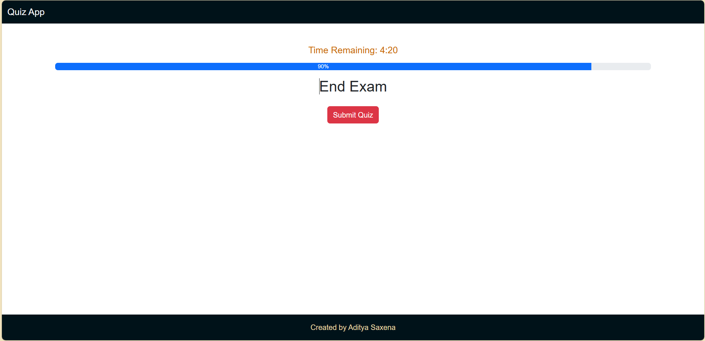

# Quiz App

This is a Quiz App that allows users to upload a file containing questions in Aiken format and run a quiz.

## Features

- Upload questions in Aiken format
- Run quizzes based on uploaded questions
- User-friendly interface

## Getting Started

### Prerequisites

- Node.js
- npm

### Installation

1. Clone the repository:
    ```sh
    git clone https://github.com/yourusername/quiz-app.git
    ```
2. Navigate to the project directory:
    ```sh
    cd quiz-app
    ```
3. Install dependencies:
    ```sh
    npm install
    ```

### Running the App

To start the development server, run:
```sh
npm start
```
Open your browser and navigate to `http://localhost:3000` to see the app in action.

## Usage

1. Click on the "Upload Questions" button.
2. Select a file containing questions in Aiken format.
3. Start the quiz and answer the questions.

## Aiken Format

The Aiken format is a simple way of writing multiple-choice questions. Here is an example:

```
What is the capital of France?
A. Berlin
B. Madrid
C. Paris
D. Rome
ANSWER: C
```

## Contributing

Contributions are welcome! Please open an issue or submit a pull request.

## License

This project is for demo purposes only. The code may not be used in any other context.

## Demonstration



